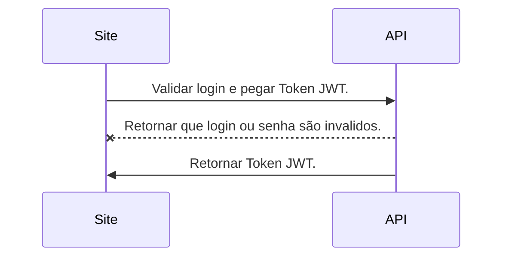
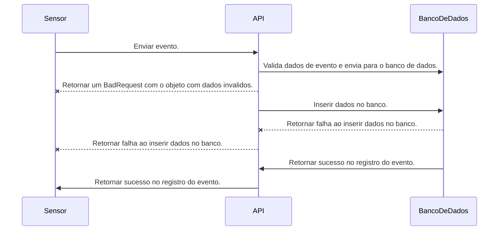

# Desafio para vaga

## É interessante que você também registre ideias que gostaria de implementar caso tivesse mais tempo.

###Ideias:

- [x] API separada por camadas no backend com repository pattern
- [x] API funcionar com docker
- [x] Documentar api com Swagger
- [x] Rginx como balanceador de carga
- [x] Criar testes unitarios com Nunit
- [x] Configurar banco de dados SQL Server em container com migrations
- [x] Docker-compose iniciar todo ambiente: frontend, backend, loadbalance e banco de dados
- [ ] Impedir que Docker-compose inicie a api antes do banco esta completamente funcional
- [ ] Frontend com Angular
- [ ] Rginx authenticando com JTW
- [ ] Criar projeto no JMeter para validar as mil requisições por segundo
- [ ] Criar testes de frontend com Jasmin/Karma
- [ ] Criar testes funcionais com Protactor
- [ ] Configurar CI no GitLab

# Instruções de uso

1. Tenha Docker instalado e ativo no local de uso;
2. Utilize container Linux;

## UML diagrams

### Diagrama de sequencia:

Obter Token

Registrar Evento
